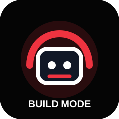
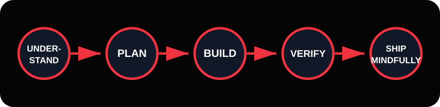

<div align="center">



<h1>LinkedIn AI Workshop 2026</h1>

<p><strong>We are no longer coding alone — a CLI-first, agentic AI, build-mode workshop by Bobby D.</strong></p>

<p><em>4 hours · Mac-friendly · terminal-first · project upgrade lab · built for the culture</em></p>

<a href="docs/00-start-here.md"><strong>🚀 Start Here</strong></a>
&nbsp;&nbsp;·&nbsp;&nbsp;
<a href="docs/02-course/agenda.md"><strong>🗓️ Agenda</strong></a>
&nbsp;&nbsp;·&nbsp;&nbsp;
<a href="docs/04-labs/lab-00-clone-and-orientation.md"><strong>🧪 Labs</strong></a>
&nbsp;&nbsp;·&nbsp;&nbsp;
<a href="starter_app/README.md"><strong>⚙️ Starter App</strong></a>

<br/><br/>



</div>

---

## For the culture 🔥

This repo is the home base for Bobby D's LinkedIn AI Project Upgrade Lab. It is not a random pile of files. It is the **student cockpit**: course notes, labs, prompts, checklists, starter code, tests, and slide notes all in one place.

The mission is simple:

> AI can help you move faster. Engineering judgment is what makes you trusted.

You will learn how to use AI tools to understand a codebase, make a small safe change, run a quality gate, explain the diff, and think like somebody who can ship responsibly.

---

## The AI engineer loop

Every exercise trains the same five-step habit:

```text
Understand  →  Plan  →  Build  →  Verify  →  Ship Mindfully
```

| Step | What it means |
|---|---|
| **Understand** | Inspect the project before changing it. Ask better questions. |
| **Plan** | Make the smallest safe plan. Do not let AI freestyle in production. |
| **Build** | Use AI as a teammate, not a replacement for your own brain. |
| **Verify** | Run tests, inspect diffs, and explain what changed. |
| **Ship Mindfully** | Know what must be true before the world sees your work. |

---

## Quick start

```bash
git clone https://github.com/thetechhustle/ai_workshop_linkedin2026.git
cd ai_workshop_linkedin2026
make install
make test
make run
```

`make run` starts the workshop book. Open <http://127.0.0.1:8001> in your browser.

To start the example app instead:

```bash
make startapp
# or
make example-app
```

Open <http://127.0.0.1:8000/docs> for the Opportunity Tracker API docs.

---

## What's inside

```text
docs/                    # Notion-style course book and workshop guide
starter_app/             # FastAPI + SQLite Opportunity Tracker API
slides/                  # Bobby D AI Workshop presenter notes
templates/               # AGENTS.md, CLAUDE.md, PR, and issue templates
scripts/                 # tmux lab cockpit helper
.github/workflows/       # GitHub Actions quality gate
Makefile                 # install, run docs, start app, test, lint, and build shortcuts
```

---

## Core make commands

```bash
make help         # See all commands
make install      # Create .venv and install docs + starter app deps
make run          # Serve the MkDocs workshop book
make serve        # Same as make run
make startapp     # Run the FastAPI starter app
make example-app  # Same as make startapp
make test         # Run the starter app tests
make lint         # Run ruff checks
make check        # Run lint, tests, and docs build
make tmux         # Launch the workshop tmux cockpit
```

---

## Student success levels

| Level | You won if... |
|---|---|
| **Bronze** | You cloned the repo, opened the workshop book, ran the app, and can explain the project. |
| **Silver** | You made one small change and verified it with a test or checklist. |
| **Gold** | You packaged, automated, or documented a production-minded next step. |

No shame in Bronze. Bronze is momentum. Momentum compounds.

---

## Start learning

- [Start Here](docs/00-start-here.md)
- [Mac setup](docs/01-setup/mac.md)
- [4-hour agenda](docs/02-course/agenda.md)
- [Labs](docs/04-labs/lab-00-clone-and-orientation.md)
- [Prompt library](docs/05-prompts/library.md)
- [Production-readiness checklist](docs/06-checklists/production.md)
- [Instructor run-of-show](docs/08-instructor/run-of-show.md)

---

## License and use

Code samples and templates are provided under the MIT License. Workshop slides and Bobby D / The Tech Hustle branded teaching materials remain owned by their respective creators and are provided here for educational use with this workshop. See [NOTICE.md](NOTICE.md).
